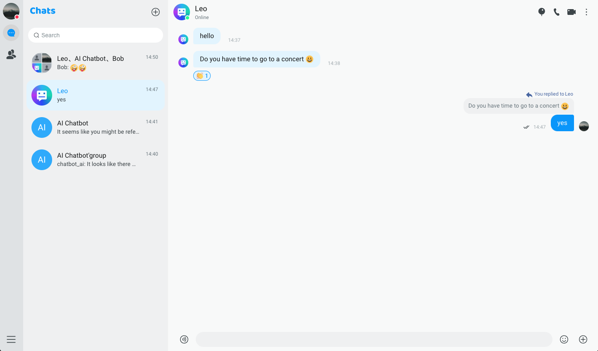

# Agora chat demo (WEB)

Agora New Version UIKit Demo: A Powerful Tool for Creating Exceptional Chat Experiences

Comprehensive Features, Productized Experience

The Agora UIKit Demo provides you with a full range of chat features, helping you easily build a powerful, productized chat experience. From basic text messaging to advanced group interactions, our demo covers all the market-standard capabilities, enabling you to meet various chat needs of your users.

Out-of-the-Box, Quick Integration

Our demo is carefully designed for easy integration into your existing applications. The clear code structure and detailed documentation allow you to get started quickly, without complex configurations or development work.

Sample Application Server Code, Simplifying Integration

To further simplify the integration process, we provide complete sample application server code, demonstrating how to create a fully functional chat app using Agora’s agora-chat-uikit. The showcased features include: user login and registration, adding friends, one-on-one chat, group chat, sending text, emojis, voice, images, files, and real-time voice and video calls. This will help you easily deploy and run chat functionalities.

Feature Highlights:
• Smooth real-time messaging
• Voice and video calls
• File sharing
• Group chat
• Threaded discussions
• Group member management
• Message notifications
• Customizable interface
• Pre-configured chat features
• Application server sample code

Start experiencing Agora’s new UIKit Demo now and begin building your dream chat application!

## Product Experience



[Project URL](https://webdemo.chat.agora.io/login)

## Prerequisite Dependencies

- A valid [Agora Account](https://console.agora.io/v2).
- An Agora project that has [enabled the Chat service](https://docs.agora.io/en/agora-chat/get-started/enable#enable-the-agora-chat-service).
- An [App key](https://docs.agora.io/en/agora-chat/get-started/enable#get-the-information-of-the-agora-chat-project) and [a user token generated on your app server](https://docs.agora.io/en/agora-chat/develop/authentication).
- In the example project, login, avatar upload, retrieving group avatars, and audio/video functionality rely on the app server for implementation. Therefore, you need to refer to the sample code to build your own app server. It is important to ensure that the appKey used in the app server matches the one configured in this project.

## Running the App

1. First, you need to implement the appServer. Then, replace the services used in src/config with your own services. After that, make sure to update the appKey and appId in the configuration files to match those used in your appServer.

2. Install Dependencies

```bash
npm install
```

3. Start the project

```bash
npm start
```

## Project Structure

```
uikit-demo-agora
├── build
|  └── static
|     ├── css
|     ├── js
|     └── media
├── config
|  ├── jest
|  └── webpack
|     └── persistentCache
├── public
├── scripts
└── src // Project Source Code
   ├── eventHandler // Event listeners in UIKit
   ├── assets
   ├── components
   |  ├── imageCrop // Image Cropper Component
   |  ├── navigationBar // Navigation Component
   |  ├── toast // Toast Component
   |  ├── userInfo // User Profile Component
   |  └── userInviteModal // Multi-User Audio/Video Invitation Component
   ├── hooks
   ├── i18n // Internationalization Text
   |  └── lang
   ├── pages
   |  ├── chatContainer // Chat Page
   |  ├── contacts // Contacts Page
   |  ├── login // Login Page
   |  ├── main // App Layout Page
   |  └── settings // Settings Page
   |     └── about // About
   |     ├── general // General
   |     ├── notification // Message Notifications
   |     ├── personalInfo // Personal Information
   |     └── settingTab // Tab Switch Component
   ├── routes // Router
   ├── service // Services Required by the Application
   ├── store // Global State
   └── utils // Utility Methods
```

## Contact Us

- You can find the complete API document at [Document Center](https://docs.agora.io/en/agora-chat/overview/product-overview?platform=web).
- You can file bugs about this demo a[issue](https://github.com/AgoraIO-Usecase/AgoraChat-web/issues).

## License

The MIT License (MIT).
